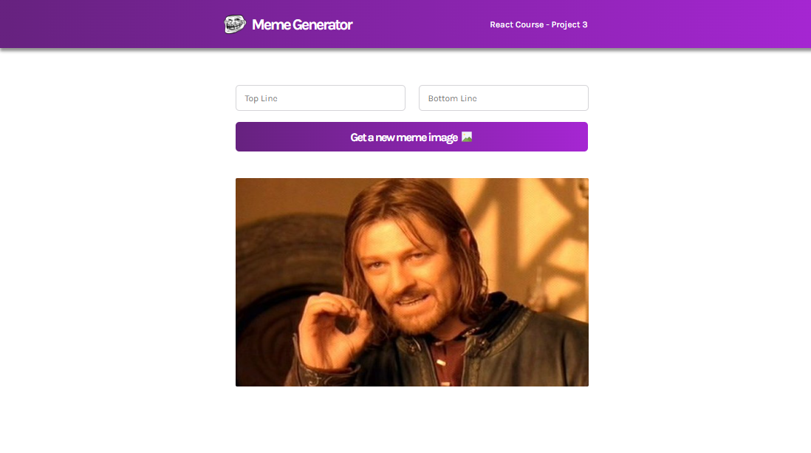

This meme generator site was created as part of the FreeCodeCamp Introduction to React course.

Meme images are obtained on initial render via an API call to the imageflip website.

## What I learned
useEffect - to maintain state during changes and to make initial API calls.
Use of async inside useEffect (though I have stuck with fetch.then in the final version.)
Utilising the spread operator inside of the setState/prevState callback.